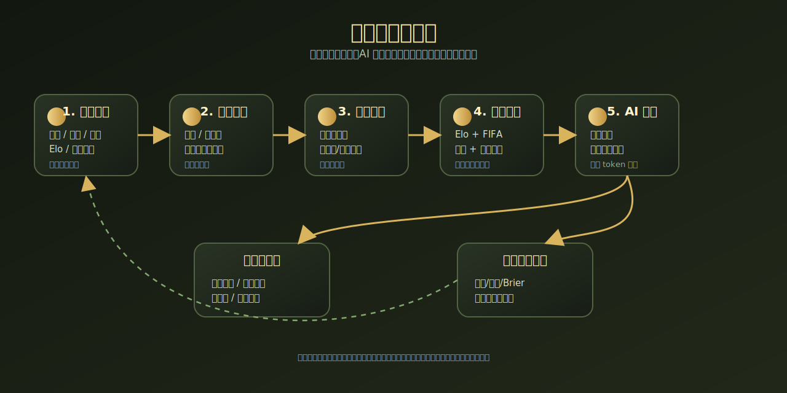
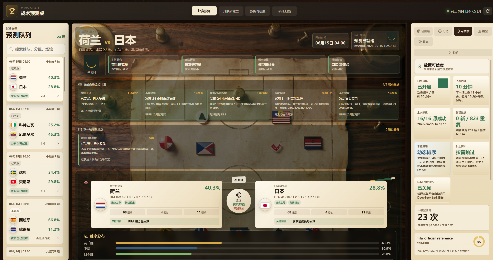
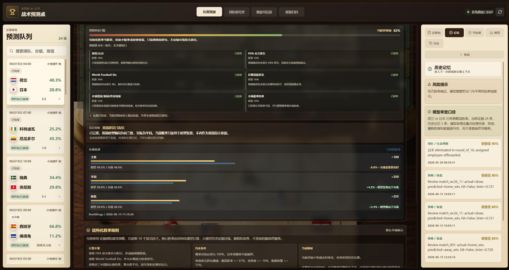
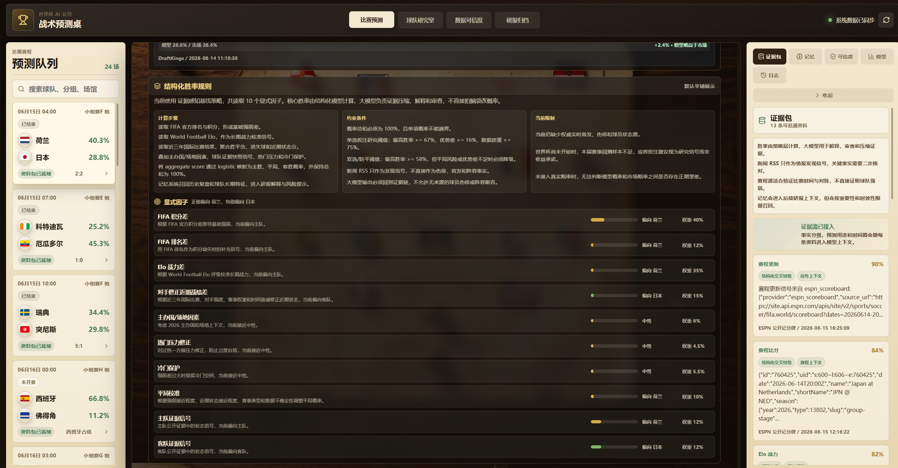
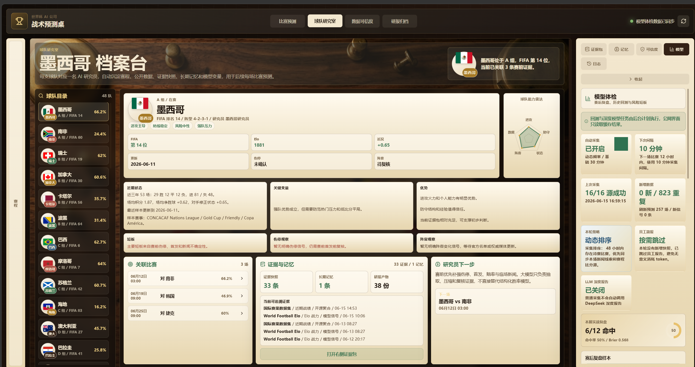
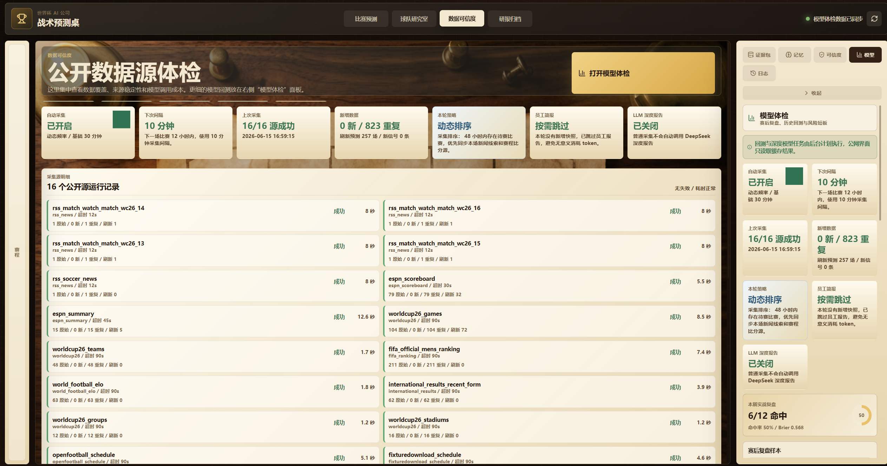

# WorldCup AI Company

一个面向世界杯赛事的 AI 自动化研究与预测系统。项目把“一个球队一个 AI 员工”的产品概念落到工程实现里：后台自动采集公开赛事数据，结构化计算胜率，AI 员工基于证据生成研报，赛后自动复盘并沉淀记忆，前端用中文战术桌展示预测队列、球队研究、数据可信度和模型体检。

> 当前项目仍处于快速迭代阶段，预测和投注建议仅用于研究与产品演示，不构成投资、博彩或任何收益承诺。




## 项目特点

- **自动采集公开数据**：集成 ESPN 赛程/比分、FIFA 排名、World Football Elo、历史赛果、RSS 新闻情报等公开来源，并保留可扩展付费数据源接口。
- **结构化胜率模型**：基于 Elo、FIFA 排名、近期状态、进攻防守、市场校准、数据质量门槛等要素生成可解释概率。
- **AI 员工协作**：每支球队对应一个研究员，模型不直接替代事实数据，而是负责证据压缩、风险解释、研报生成和赛后复盘。
- **长期记忆系统**：比赛结束后写入复盘记忆，后续预测可读取历史判断、命中偏差和球队变化。
- **过程可追踪**：记录数据快照、采集日志、分拣过程、算法计算结果、LLM 调用摘要和成本估算。
- **中文战术桌 UI**：提供比赛预测、球队研究、数据可信度、模型体检、过程日志等页面，适合中文用户理解。

## 界面预览

### 比赛预测







### 球队研究室



### 数据可信度



## 技术架构

```text
公开数据源
  ├─ ESPN 赛程/比分
  ├─ FIFA 官方排名
  ├─ World Football Elo
  ├─ 历史战绩/近期状态
  ├─ RSS 新闻情报
  └─ 市场赔率校准

.NET 后端
  ├─ AutoCollectionService     自动采集调度、动态优先级、去重
  ├─ DataSourceAdapter         外部数据源适配
  ├─ WorldCupStore             SQLite 持久化、证据、记忆、报告
  ├─ ProductViews              面向前端的 BFF 聚合视图
  ├─ Prediction Engine         结构化胜率模型、质量门槛、赛后回测
  └─ LlmGateway                DeepSeek / OpenAI 兼容模型调用

React 前端
  ├─ 预测队列
  ├─ 战术桌详情
  ├─ 球队研究室
  ├─ 数据可信度
  ├─ 模型体检
  └─ 过程日志
```

## 目录结构

```text
.
├─ Api/                         HTTP API
├─ Core/                        自动采集、上下文复核等核心服务
├─ Domain/                      世界杯、产品视图、工作流领域模型
├─ Features/                    业务功能：数据源、情报、预测、研报、工作流
├─ Infrastructure/              SQLite、LLM、数据源适配等基础设施
├─ Serialization/               System.Text.Json 源生成上下文
├─ UI/                          旧版内嵌 UI，保留兼容
├─ Frontend/worldcup-ui/        React + Vite 中文战术桌前端
├─ docs/                        架构设计、路线图、截图和系统说明图
├─ design-demos/                UI 方向探索 demo
├─ start.bat / start.ps1        Windows 一键启动脚本
├─ stop.bat / stop.ps1          Windows 停止脚本
└─ data-source-providers.template.json
```

## 运行环境

- Windows 10/11
- .NET SDK 10.0 或项目兼容版本
- Node.js 20.19+ 或 22.12+
- npm

## 快速启动

```powershell
git clone https://github.com/papaoo/WorldCup-AI-Company.git
cd WorldCup-AI-Company

# 启动后端和前端
.\start.bat
```

默认访问地址：

- 后端 API：`http://localhost:4050/`
- 前端页面：`http://127.0.0.1:5174/`

也可以分别启动：

```powershell
# 后端
dotnet run --urls http://localhost:4050

# 前端
cd Frontend/worldcup-ui
npm install
npm run dev
```

## 大模型配置

项目支持 OpenAI 兼容接口。建议把密钥放在环境变量或本机私有配置里，不要提交到仓库。

```powershell
$env:LLM_PROVIDER="deepseek"
$env:DEEPSEEK_API_KEY="你的 DeepSeek Key"
$env:DEEPSEEK_BASE_URL="https://api.deepseek.com"
$env:DEEPSEEK_MODEL="deepseek-chat"
```

可参考 `.env.example`。普通公开数据采集不会频繁调用大模型；深度报告、模型复核和研报生成才会消耗 token。

## 数据源策略

项目优先使用公开、免费、无 Key 数据源：

- 赛程/比分：ESPN scoreboard / summary
- 排名：FIFA 官方排名
- 战力：World Football Elo
- 历史赛果：公开国际比赛结果数据
- 新闻情报：公开 RSS
- 赛程交叉校验：公开赛程数据源

对于需要 Key 的数据源，代码保留扩展点，但默认不启用。生产环境建议配置后台自动刷新频率，避免每个访客触发采集和模型调用。

## 关键接口

```text
GET  /api/worldcup/health
GET  /api/worldcup/product/overview?limit=6
GET  /api/worldcup/product/matches/{matchId}
GET  /api/worldcup/product/model-health
GET  /api/worldcup/auto-collection-last-run
POST /api/worldcup/auto-collection-run
```

## 开发与验证

```powershell
# 后端构建
dotnet build

# 前端构建
cd Frontend/worldcup-ui
npm install
npm run build
```

如果 Windows 下构建失败并提示输出文件被占用，先停止运行中的进程：

```powershell
.\stop.bat
```

## 设计原则

1. **事实和概率由结构化数据负责**  
   LLM 不直接替代比分、排名、赛程和历史数据。

2. **LLM 负责解释、复核和报告**  
   大模型用于压缩证据、发现风险、生成研报和赛后复盘。

3. **每个结论都要可追踪**  
   预测结果需要能追溯到数据源、证据快照、模型规则和生成时间。

4. **后台自动化，前台只读为主**  
   面向公网时，用户不应手动触发重型采集和模型调用。

5. **可扩展到其他业务场景**  
   当前是世界杯，未来可以迁移到股票盯盘、舆情监控、行业研究、自动化办公等 AI Agent 场景。

## 免责声明

本项目仅用于 AI 自动化工作流、公开数据融合、赛事分析和软件工程实践研究。任何比赛预测、胜率、策略建议都存在不确定性，不构成博彩、投资或财务建议。
